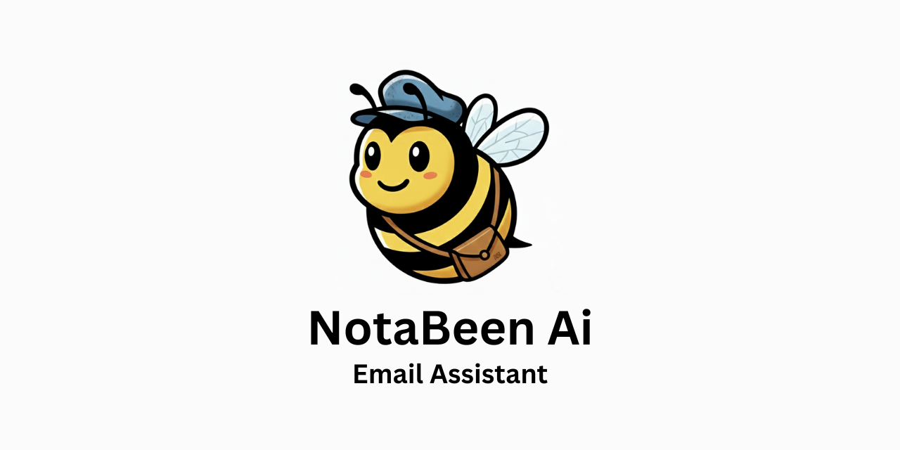

<p align="center">
  
</p>

### NotaBeen

**An open-source AI powered email assistant for reducing inbox overload.**

<br/>

<div align="center">
  <a href="https://github.com/NotaBeen/notabeen-ai-email-assistant/stargazers"></a>
  <a href="https://github.com/NotaBeen/NotaBeen/blob/main/LICENSE"></a>
</div>

<br/>

NotaBeen is an open-source email assistant that uses AI to help you manage your inbox more efficiently. It helps you quickly summarize emails, generate smart replies, and categorize messages to reduce inbox overload.

## Features

- **AI-Powered Summarization:** Get a quick overview of long emails with AI-generated summaries.
- **Automated Categorization:** Automatically sort incoming emails into categories like "Urgent," "Important," "Can Wait," "Unsubscribe," and "Unimportant" to prioritize what matters.
- **Secure Inbox Management:** Manage your email without worrying about your data, as NotaBeen is self-hostable.

## Tech Stack

- [Next.js](https://nextjs.org/) – Framework
- [Material UI](https://mui.com/) – UI Components
- [MongoDB](https://www.mongodb.com/) – Database
- [Google Gemini API](https://ai.google.dev/docs/gemini_api_overview) – AI Engine

## Getting Started

### Prerequisites

Here's what you need to run NotaBeen:

- Node.js (version >= 18.0.0)
- MongoDB Database
- A Google Gemini API Key

### 1. Clone the repository

```shell
git clone [https://github.com/NotaBeen/notabeen-ai-email-assistant.git](https://github.com/NotaBeen/notabeen-ai-email-assistant.git)
cd NotaBeen
```

### 2. Install npm dependencies

```shell

npm install
```

### 3. Set up environment variables

Create a .env.local file in the root directory and add the following required variables. These are essential for the core functionality of the application.

```shell
APP_BASE_URL=http://localhost:3000/
AUTH0_CLIENT_ID=
AUTH0_CLIENT_SECRET=
AUTH0_DOMAIN=
AUTH0_SECRET=use [openssl rand -hex 32] to generate a 32 bytes value
ENCRYPTION_IV=
ENCRYPTION_KEY=
GEMINI_API_KEY=
MONGODB_URI=
MONGO_CLIENT=
```

### Environment Variable Instructions

#### Required Variables (For all contributors)

- **`APP_BASE_URL`**: This is the base URL for your application. For local development, it should be set to `http://localhost:3000/`.
- **`AUTH0_CLIENT_ID`**: Your **Auth0** application client ID. This is required for user authentication and can be found in your [Auth0 dashboard](https://manage.auth0.com/).
- **`AUTH0_CLIENT_SECRET`**: Your **Auth0** application client secret, also found in your [Auth0 dashboard](https://manage.auth0.com/). It's used to securely authenticate your application.
- **`AUTH0_DOMAIN`**: Your **Auth0** domain, which looks something like `your-account.us.auth0.com`. You'll find this in your [Auth0 dashboard](https://manage.auth0.com/).
- **`AUTH0_SECRET`**: A long, random string used to encrypt and sign cookies. To generate a secure value, run `openssl rand -hex 32` in your terminal.
- **`ENCRYPTION_IV`**: An **Initialization Vector** (IV) for data encryption. A simple way to generate this is by using `openssl rand -hex 16` in your terminal.
- **`ENCRYPTION_KEY`**: A **symmetric key** for data encryption. You can use `openssl rand -hex 32` to generate it in your terminal.
- **`GEMINI_API_KEY`**: Your API key for the **Google Gemini API**. This is essential for the AI-powered features. You can get this from the [Google AI Studio](https://aistudio.google.com/app/apikey) or [Google Cloud Console](https://cloud.google.com/gemini/docs/api/get-started/rest).
- **`MONGODB_URI`**: The connection string for your **MongoDB** database. You can get this from a service like [MongoDB Atlas](https://www.mongodb.com/atlas) or by setting up a local MongoDB instance.
- **`MONGODB_CLIENT`**: Set any name for your Mongo client

#### Optional Variables (For development and production)

The following variables are not strictly necessary for running the application, but may be useful for a complete local setup or for cloud deployment.

- **`APP_BASE_URL`**: This is the base URL for your application. For local development, it should be set to `http://localhost:3000/`.
- **`NEXT_PUBLIC_DOMAIN_URL`**: The public URL for API routes. For local development, this is typically `http://localhost:3000/api/`.
- **`NEXT_PUBLIC_POSTHOG_HOST`**: The URL of your **PostHog** instance, used for analytics.
- **`NEXT_PUBLIC_POSTHOG_KEY`**: The public API key for your **PostHog** instance.
- **`NODE_ENV`**: The environment mode. For local development, it is typically `development`, but for a production build, set this to `production`.

### 4. Run the dev server

```shell

npm run dev
```

### 5. Open the app in your browser

Visit [http://localhost:3000](http://localhost:3000) in your browser.

## **Important Note:** Currently, the app only supports Gmail.

## Contributing

We <3 contributions big and small:

- Open a PR to fix a bug or add a new feature.
- Submit a [feature request](https://github.com/NotaBeen/notabeen-ai-email-assistant/issues/new?assignees=&labels=enhancement%2C+feature&template=feature_request.md) or [bug report](https://github.com/NotaBeen/notabeen-ai-email-assistant/issues/new?assignees=&labels=bug&template=bug_report.md).
- Vote on features or get early access to beta functionality in our roadmap.

---

## Open-source vs. paid

This repo is available under the [MIT expat license](https://github.com/NotaBeen/notabeen-ai-email-assistant/blob/main/LICENSE).

